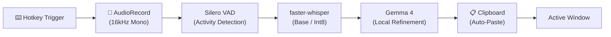

# Voice IME — Product Specification

A **100% local, privacy-first voice input method** for Windows, macOS, and Android. Speak into your microphone and have polished, well-formatted text injected into any active application.

## 🚀 Key Features

*   **100% Local Processing:** Your voice data never leaves your device. No cloud APIs, no subscriptions.
*   **Continuous Dictation:** Naturally chunked translation. If you leave it running, it will automatically pause when you stop speaking, process the audio, paste the text, and continue listening for your next sentence.
*   **AI Auto-Correction (Gemma 4):** Not just transcription! The local LLM acts as an editor, fixing grammar, punctuation, and formatting seamlessly.
*   **Custom Vocabulary (New!):** Add specific names, terminology, or acronyms to bias the STT model and prompt the LLM to use the correct spellings.
*   **Multi-Language Code-Switching:** Specifically designed for users who mix languages (e.g., English-Chinese mixed).

---

## 🛠️ How It Works (The Pipeline)

### Does it translate just once? 
**No, it translates continuously!** Voice Activity Detection (VAD) handles chunking automatically. 
*   In **Toggle Mode**: You press the hotkey to start capturing. When you speak, it records. When you pause for a natural breath (0.8 seconds of silence) or hit the 15-second buffer limit, it instantly flushes the buffer, translates, and pastes it into your text field. *Meanwhile, it is already listening for your next sentence.* It will keep pasting until you press the hotkey again to stop it.
*   In **Push-to-Talk Mode**: It only listens while you physically hold down the keys.

---

## ⚙️ Configuration & User Preferences

Right-click the system tray icon and select **Settings...** to configure the IME.

### Language Mode
*   **Auto Detect:** Whisper tries to determine the language on its own.
*   **en-zh (English-Chinese mixed):** Optimized specifically for users who mix languages. This provides explicit instructions to both Whisper and Gemma to expect code-switching, preventing them from trying to incorrectly translate English into Chinese or vice-versa.
*   **en, zh, ja, etc.:** Forcibly lock the translation into a single language.

### Custom Vocabulary
A comma-separated list of specialized terms, names, or industry jargon (e.g., `Kubernetes, Azure, ShelfEng`). 
*   **Whisper** receives this list via the `initial_prompt` attribute, heavily biasing the decoder toward recognizing these sound patterns.
*   **Gemma 4** receives this list in its system prompt, treating it as a hard rule for proper noun spelling, acting as a secondary safety net.

### Text Refinement & Instructions
You can provide free-form natural language instructions to guide the LLM's behavior.
*   *Examples:* "Always use formal business tone", "Format output specifically as bullet points", or "Do not add periods at the end of sentences."

---

## 💻 Supported Platforms

### Windows (Phase 1 - Complete)
*   Fully packaged standalone executable (`VoiceIME.exe`).
*   Global hotkeys bound via `pynput` hook.
*   Settings GUI managed through `Tkinter`.
*   Includes a First-Run Wizard that automatically downloads models and provisions Ollama.

### macOS (Phase 2 - Code Complete)
*   Platform detection handles hotkey remapping automatically (e.g. `Cmd+Opt+R` instead of `Ctrl+Alt+R`).
*   Integrated `macos_permissions.py` script to seamlessly prompt the user for **Microphone** and **Accessibility** permissions (required for clipboard paste via AppleScript/Cmd+V injection).

### Android (Phase 3 - Scaffolded)
*   Designed as a native `InputMethodService` (Custom Android Keyboard instance).
*   Interfaces ready for:
    *   **WhisperEngine:** requires `whisper.cpp` cross-compiled with Android NDK + JNI bridge.
    *   **GemmaEngine:** requires Google MediaPipe LLM Inference API downloading local `gemma4-e2b-it.task` models.

---

## ⌨️ Hotkeys (Desktop)

| Hotkey | Action |
|---|---|
| `Ctrl+Alt+R` (Win) / `Cmd+Alt+R` (Mac) | Toggle continuous recording mode on/off |
| `Ctrl+Alt+V` (Win) / `Cmd+Alt+V` (Mac) | Push-to-talk (hold keys to record, release to translate) |

*(Note: Push-to-talk mode requires changing Hotkey configuration in `%APPDATA%/VoiceIME/config.json`)*

---

## 🏗️ Architecture & Infrastructure

The application is structured into decoupled modules to support cross-platform portability.

```mermaid
flowchart TD
    %% Define Styles
    classDef ui fill:#89b4fa,stroke:#1e1e2e,stroke-width:2px,color:#1e1e2e,font-weight:bold
    classDef core fill:#cba6f7,stroke:#1e1e2e,stroke-width:2px,color:#1e1e2e,font-weight:bold
    classDef external fill:#a6e3a1,stroke:#1e1e2e,stroke-width:2px,color:#1e1e2e,font-weight:bold
    classDef storage fill:#f38ba8,stroke:#1e1e2e,stroke-width:2px,color:#1e1e2e,font-weight:bold

    subgraph "👤 User Interface"
        TRAY["Tray Icon (pystray)"]:::ui
        SET["Settings (Tkinter)"]:::ui
        OVL["Status Overlay (Tkinter)"]:::ui
    end

    subgraph "⚙️ Core Application"
        MAIN["main.py (Orchestrator)"]:::core
        CFG["config.py"]:::core
        SETUP["first_run_setup.py"]:::core
        
        MAIN <--> CFG
        MAIN --> SETUP
        MAIN --> TRAY
        MAIN --> OVL
    end

    subgraph "🎧 Engine Components"
        AUD["audio_capture.py"]:::core
        STT["speech_to_text.py"]:::core
        LLM["text_refiner.py"]:::core
        INJ["text_injector.py"]:::core
        
        MAIN --> AUD
        MAIN --> STT
        MAIN --> LLM
        MAIN --> INJ
    end

    subgraph "💾 Data & Storage"
        LOCAL["%APPDATA%/VoiceIME/"]:::storage
        MODELS["/models\n(Whisper, VAD, Ollama)"]:::storage
        LOGS["/logs/voice-ime.log"]:::storage
        CFGDAT["config.json"]:::storage
        
        LOCAL --- MODELS
        LOCAL --- LOGS
        LOCAL --- CFGDAT
        CFG -.-> CFGDAT
        SETUP -.-> MODELS
    end

    subgraph "🔌 OS & integrations"
        MIC["Microphone\n(sounddevice)"]:::external
        CLIP["Clipboard API\n(Windows/macOS)"]:::external
        KEYBOARD["Keyboard Simulation\n(pynput)"]:::external
        OLLAMA["Ollama Server"]:::external
        
        AUD --> MIC
        INJ --> CLIP
        INJ --> KEYBOARD
        LLM <--> OLLAMA
    end
```

